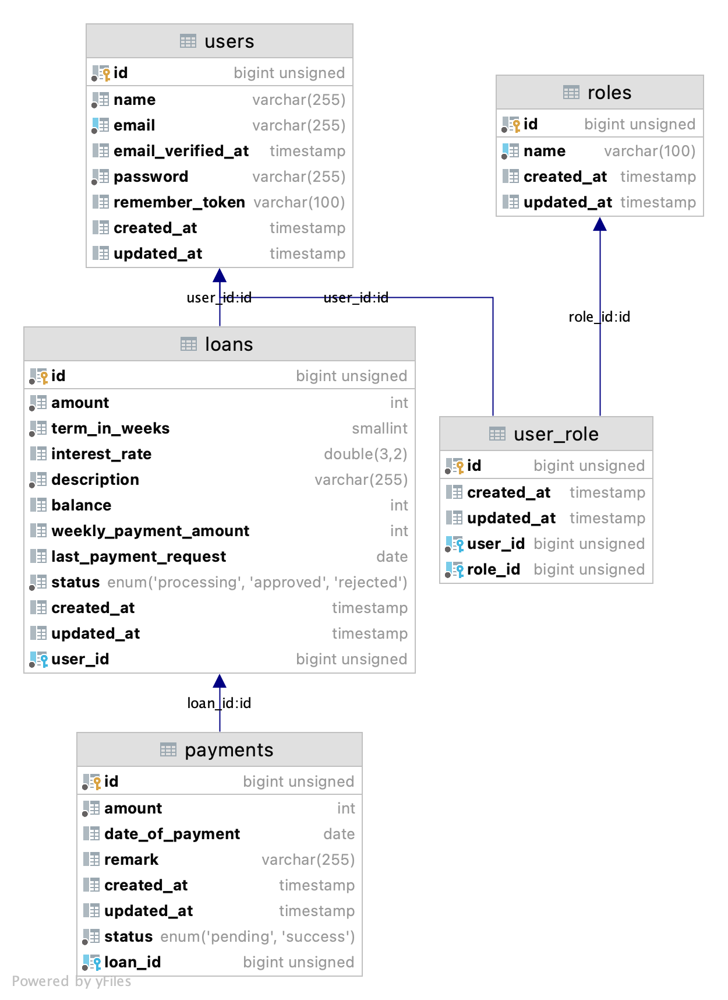
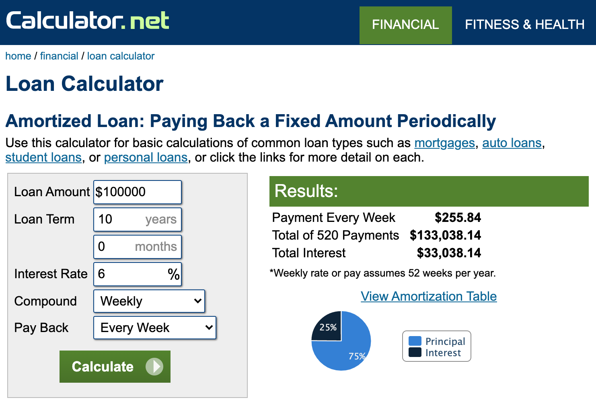

## Mini Aspire API

### Requirement

- Make sure to install [Docker Desktop](https://www.docker.com/products/docker-desktop)
- PHP >= 7.2.5
- Composer

### Installation

1. Open terminal and run these command:
    ```
    git clone https://github.com/khanhdo2000/mini-aspire-api.git
    cd mini-aspire-api
    composer install
    ./vendor/bin/sail up
    ```
2. Grab your local machine api

   If you are using mac or linux, open terminal and run
    ```
    ifconfig | sed -En 's/127.0.0.1//;s/.*inet (addr:)?(([0-9]*\.){3}[0-9]*).*/\2/p'
    ```
   Then, replace your ipaddress acquired above and replace it in `.env` file:
    ```
    DB_HOST=127.0.0.1
    ```
   change it to
    ```
    DB_HOST=192.168.0.104
    ```
3. Open another terminal and run
    ```
    php artisan migrate
    php artisan db:seed
    ```

   By running Laravel seeder, these 2 users will be generated for us:

   Customer: ``user@gmail.com/password``

   Aspire BA: ``ba@aspireapp.com/password``

You are ready to use the API

### Postman collection

Please refer to json collection file inside ``.postman_collection`` directory

### Test

Open new terminal and run

```
php artisan test
```

Test scope:

- Test weekly payment amount calculation
- Test total payment amount calculation
- Loan balance calculation

Tests are based on:

- Loan amount $100.000
- Loan term 10 years (520 weeks)
- Annual interest rate 6%
- Weekly payback frequency

### Database


Database design is fairly simple for the scope of this demonstration.

- ``users`` table is used for both customer and Aspire Admin/BA
- ``roles`` table store different roles: ``customer``/``ba`` (business analyst). Entity ``user`` can have
  multiple ``role`` via ``user_role`` table
- ``loans`` table is used for storing loan request as well as storing loan balance and weekly payment amount
- ``payments`` table hold weekly payment request generated by backend and keep track of user payment status.

### Assumptions

- General currency is dollars and money number is stored in cent
- Assume there are 2 different roles: Customer/BA
    - Customer can submit loan application and view payment request
    - BA can approve/reject customer loan application

### Specifications

- Cronjob run beginning of every week to check loan and generate payment request, then send notification to customers
  ```
    $schedule->call(function () {
        (new PaymentService)->generatePaymentRequest();
    })->weeklyOn(1, '0:00'); //monday 12:00 am
  ```
- Event allows us to subscribe and listen for events occurred in our application, some events we use in this application
  are:
    - Loan application submitted
    - Loan application approved
    - Loan application rejected
    - Payment request created (system generated)
    - Payment success (customer settled weekly payment request)

      Events serve as a great way to decouple our application, as application become more complex, we transform
      application into platform, with event architecture we can move our app to cloud and implement microservice
      architecture

- Amount of money is stored using ``interger`` as we don't want to deal with precision loss. Money value should be
  multiplied by smallest unit (cents for dollars) and store it as integer.

- Interest is calculated based on weekly payback frequency and weekly compound interest.
  This [online loan calculator](https://www.calculator.net/loan-calculator.html?cloanamount=100000&cloanterm=10&cloantermmonth=0&cinterestrate=6&ccompound=weekly&cpayback=weekly&x=95&y=11#amortized-result)
  is used as a reference for this API.

  

- Reference of loan calculation formula

  

### Potential improvements

- A new table ``payment`` should be used to separate it self from ``payment request``
- Loan payment statuses to be defined in separate table
- Event listener should be processed in queue to perform slow task such as sending email or notification.
- New payment request to customer should be schedule at day time
